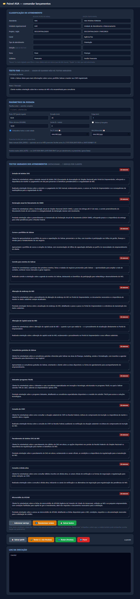

# 🤖 Playwright RPA — Bulk Attendance Automation


**🌐 Language:** English · [🇧🇷 Português](README.pt-BR.md)

A **RPA bot** that registers **hundreds of attendance records** into a corporate web
system (the ASA Externo, a Sebrae-AM PWA) straight from spreadsheets — plus a **local
web panel** to configure and launch the runs. It turns **hours** of repetitive manual
data entry into **minutes**, while keeping login and sensitive data under the user's
control.

> A real project, used in production to hit attendance targets.
> Client data (national IDs) and login sessions **never** enter the repository.

---

## 💡 The problem

Registering hundreds of attendances by hand in a web system is slow and error-prone:
each record means going through a **5-step wizard** (find client, link/register the
company, contacts, address, classification and time slot) in an **offline-first PWA**
with virtualized menus and a locked calendar.

## ⚙️ The solution

- A **Python + Playwright bot** that drives the actual Chrome app end to end, filling in
  and finalizing each attendance from the spreadsheet.
- A **local web panel** (no dependencies beyond Python) to pick unit, project, theme,
  texts and run parameters — with a **live log**.
- **Rotating texts** that vary per client (covering every service topic), so the records
  don't look repetitive.

## 📊 Results

- **240+ attendances** launched end to end by the bot (80 for one unit + 160 for another).
- A **120-hour** attendance target met — with the manual work reduced from hours to minutes.
- **~40 seconds per record**, unattended, versus several minutes each by hand.
- **Zero passwords handled** by the bot and **zero personal data** committed to the repo.

## ✨ Technical highlights

- **Attaches over CDP to an already-logged-in Chrome** — login is always human; the bot
  **never** handles passwords.
- Bypasses the **PWA install gate** (`matchMedia: display-mode standalone`) by injecting a
  patch with `add_init_script`.
- Handles **virtualized Ant Design menus** (scroll-to-option) and a **read-only DatePicker**
  (calendar navigation).
- **Config-driven**: project profiles (`PERFIS` / `CUSTOM`) + environment variables;
  schedule by **dates** or **explicit time slots** (`ASA_SLOTS`), with duration/gap/cutoff.
- **Smart scheduling**: business days only, respects free windows and business hours.
- **Idempotent & resumable**: persisted progress (no duplicates), **expired-session**
  detection, debug screenshots on every error.
- **Web panel on the standard library** (`http.server`), with a text editor and a shuffle
  button.
- **Privacy by default**: `.gitignore` shields spreadsheets, Chrome profiles, progress and
  logs — no personal data is ever versioned.

## 🖥️ Control panel

A local page (`http://localhost:8760`) builds the configuration and launches the bot,
with a real-time log:



## 🧱 Stack

`Python 3` · `Playwright` · `openpyxl` · `HTML/CSS/JS` (vanilla) · `http.server` (stdlib)

## 🚀 Getting started

```bash
python -m pip install -r requirements.txt
python -m playwright install chrome
```

1. Open the target system in Chrome with a debugging port and **log in**.
2. Launch the panel (double-click `PAINEL.bat`) **or** run directly:

```bash
ASA_PERFIL=UAR ASA_CDP=9224 ASA_PLANILHA=clientes.xlsx python lancar_atendimentos.py
```

Full operations guide (PT) in [`PROCEDIMENTOS.md`](PROCEDIMENTOS.md).

## 📁 Structure

```
lancar_atendimentos.py   # main bot (Playwright)
painel.py / PAINEL.bat   # local web control panel
textos_variados.json     # pool of guidance texts (rotate per client)
PROCEDIMENTOS.md         # operations guide
requirements.txt
```

## 🔒 Privacy & security

Client spreadsheets, Chrome profiles (login sessions), progress and logs stay **out of the
repository** (see `.gitignore`). The bot never types or stores passwords — authentication
is done manually by the operator in the browser window.
